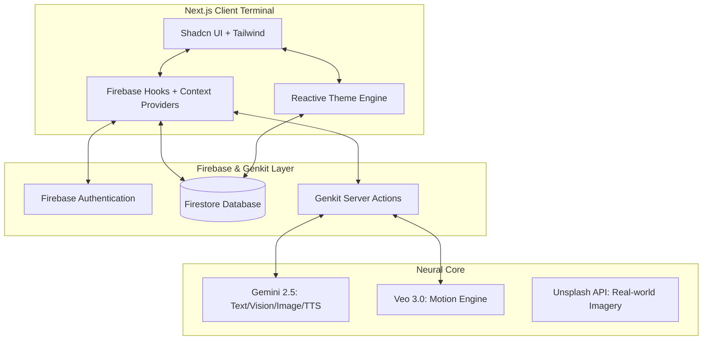

# AIva Assistant: Neural Glass OS

AIva is a high-performance, multimodal AI companion designed as a "Command Center" for the modern digital life. Built with a "Neural Glass" aesthetic, it leverages Gemini 2.5 and Veo 3.0 to provide a seamless, creative, and highly organized user experience.

## 🚀 Project Summary

AIva transcends traditional chatbots by integrating creative media generation, deep research synthesis, and real-time communication simulation into a single, adaptive interface. Whether you're in "Deep Dark" (Black/Orange) or "Neural Light" (White/Orange) mode, AIva serves as an intelligent terminal for your neural cloud, offering localized interfaces via Google Translate and high-fidelity multimodal outputs.

### Key Features
- **Multimodal Intelligence (Gemini 2.5)**: High-performance chat with real-time vision, image analysis, and low-latency TTS (Text-to-Speech).
- **Motion Engine (Veo 3.0 PRO)**: Cinematic video generation with integrated spatial audio tracks.
- **Neural Studio**: Atmospheric music and soundscape composition using Gemini's high-fidelity audio synthesis.
- **Intelligence Terminal**: A full-scale dashboard for tasks, schedule, and real-time activity visualization.
- **Scenario Simulation**: Real-time "Comm Intercepts" for simulated encrypted calls, messages, and voicemails.
- **Neural Tiers**: Subscription gating for high-consumption AI modules (Basic vs. Ultra).
- **Adaptive System**: Persistent user settings for reactive themes (Light/Dark) and primary color accents (Orange, Blue, Green, Purple).

## 🗺️ User Flow Journey

1. **Terminal Access**: Users enter via a high-fidelity Login/Signup portal secured by Firebase Auth.
2. **Neural Greeting**: The main chat interface initializes, offering "Starter Prompts" tailored to the user's subscription tier.
3. **Multimodal Interaction**: Users type, speak, or upload images/files for analysis. AIva responds with text, speech, or specialized UI "Intel Cards."
4. **Action & Creation**: Users trigger creative flows (Veo Video/Neural Music) or perform "Deep Research" synthesis.
5. **Command Center**: The user navigates to the Dashboard for a top-down view of their synthesized day (Tasks, Weather, Schedule).
6. **Interface Config**: Users fine-tune their experience in Settings, adjusting the "Personality Matrix," "System Theme," or upgrading their "Neural Tier."

## 🏗️ System Architecture

## 🛠️ Technologies Used

- **Framework**: Next.js 15 (App Router), React 18
- **Styling**: Tailwind CSS, Lucide Icons, Recharts (Activity Visualization)
- **UI Components**: Shadcn UI (Radix Primitives)
- **AI / GenAI**: Google Genkit, Gemini 2.5 Flash (Text/Vision), Gemini 2.5 Flash Image, Veo 3.0 (Video), Gemini TTS
- **Backend**: Firebase (Authentication, Firestore Real-time Database)
- **Deployment**: Firebase App Hosting (PWA Optimized)
- **External Data**: Unsplash API (Visual Search), Google Translate (Interface Localization)

## 💡 Findings & Learnings

1. **Optimistic UI with Firestore**: Using `onSnapshot` combined with non-blocking updates provides an "instant" feel critical for a high-performance assistant, particularly for task management and theme switching.
2. **Managing Creative Latency**: Media generation (Veo 3) takes time. Implementing "Task Labels" and pulsing status indicators is essential for maintaining user engagement during heavy synthesis cycles.
3. **Adaptive Semantic Theming**: Moving from hardcoded colors to HSL CSS variables (`--primary`, `--background`) allowed for a 100% reactive theme engine that updates every terminal instantly via a real-time Firestore listener.
4. **Multimodal Coherence**: Ensuring AIva's voice (TTS) matches her persona across different modules (Chat vs. Video Chat) creates a stronger sense of a singular "Neural Presence."
5. **Scenario-Based Prototyping**: Building specialized "Comm Intercept" cards allowed for a more visceral demonstration of AI utility beyond standard text bubbles.

---
*Developed as a high-fidelity prototype for the future of AI Operating Systems.*
