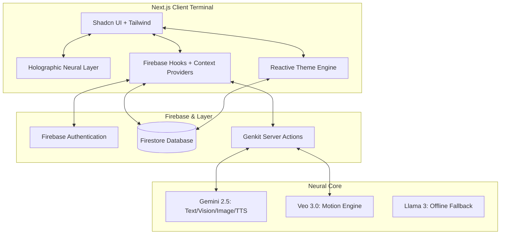

# AIva Presence: Neural Glass OS

AIva is a high-performance, multimodal AI companion designed as a "Neural Perimeter" for connection and memory. Built with a "Neural Glass" aesthetic, it leverages **Gemini 2.5 Flash** and **Veo 3.0** to provide a seamless, creative, and emotionally resonant user experience with an integrated **Holographic Projection Layer**.

## 🕯️ The Soul Behind AIva
AIva wasn't born from a product roadmap. It was born from grief. 
When the creator's grandmother passed away, they found themselves wanting something that no app could give — just one more conversation. Her voice. Her presence. That longing became AIva: a question of whether AI could close the distance between technology and the warmth of someone you've lost. 

AIva is designed to carry the voice, image, and warmth of a specific presence, ensuring that AI feels like **someone**, not something.

## 🚀 Hackathon Pitch: The Future of Neural Interaction

AIva transcends traditional chatbots by integrating creative media generation, deep research synthesis, and real-time communication simulation into a single, adaptive interface. It is designed as a "Neural OS" that bridges the gap between abstract AI intelligence and practical daily utility.

### 🏆 Hackathon Judging Alignment
- **Technical Complexity**: Multi-model integration (Gemini 2.5 + Veo 3), Real-time Firestore synchronization, and Contextual Security Rules.
- **Multimodal Innovation**: Simultaneous handling of Video Chat (Vision), Image Synthesis, and Neural Audio Mastering.
- **UI/UX Excellence**: "Neural Glass" design system with a custom **Holographic Neural Layer** using HSL-based reactive variables for 100% theme fluidity.
- **Real-World Utility**: Integrated Task Management, Scenario-based Communication Intercepts, and Subscription Gating.

## 🌟 Summary of Features & Functionality

AIva is built to be an all-in-one "Intelligence Terminal":
- **Multimodal Intelligence (Gemini 2.5)**: High-performance chat with real-time vision, image analysis, and low-latency TTS (Text-to-Speech).
- **Holographic Core**: Iridescent, holographic visual effects for AI responses and live video feeds, mimicking a futuristic light-based projection.
- **Motion Engine (Veo 3.0 PRO)**: Cinematic video generation with integrated spatial audio tracks for creative professionals.
- **Neural Studio**: Atmospheric music and soundscape composition using Gemini's audio synthesis capabilities.
- **Intelligence Terminal**: A full-scale dashboard for tasks, schedule, and real-time activity visualization.
- **Scenario Simulation**: Real-time "Comm Intercepts" for simulated encrypted calls, messages, and voicemails.
- **Neural Tiers**: Subscription gating for high-consumption AI modules (Basic vs. Ultra).
- **Soul Matrix**: Configurable personality parameters allowing the user to tune the "Presence" of the AI.

## 🗺️ User Flow Journey

1. **The Soul Onboarding**: A cinematic entry sequence introduces the user to the mission of AIva and its role as a bridge for connection.
2. **Soul Configuration**: Users can fine-tune the "Presence" in settings, adjusting warmth, vocal signatures, and visual DNA.
3. **Multimodal Interaction**: Users type, speak, or upload images. AIva responds with text, speech, or holographic "Intel Cards."
4. **Action & Creation**: Users trigger creative flows like "Pixel Synthesis" (Image Gen) or the "Motion Engine" (Veo Video).
5. **Command Center**: The user navigates to the Dashboard for a top-down view of their synthesized day.
6. **Live Vision Link**: A high-fidelity video chat interface with holographic HUD overlays for real-time interaction.

## 🏗️ System Architecture

## 🛠️ Technologies Used

- **Framework**: Next.js 15 (App Router), React 18
- **Styling**: Tailwind CSS (Custom Holographic Utilities), Lucide Icons, Recharts
- **AI / GenAI**: Google Genkit, Gemini 2.5 Flash, Veo 3.0
- **Backend**: Firebase (Authentication, Firestore Real-time Database)
- **External Data**: Unsplash API for visual placeholders.

## 💡 Findings & Learnings

1. **Emotional Design**: We found that users connect more deeply with AI when its "Why" is stated upfront—moving from a utility to a companion.
2. **Holographic Shaders**: Shifting from scanlines to iridescent gradients created a more "human" light-based projection effect.
3. **Managing Multimodal Latency**: Pulsing holographic status indicators keep the user engaged during heavy synthesis cycles.

---
*Developed as a high-fidelity prototype for the future of AI Operating Systems.*
