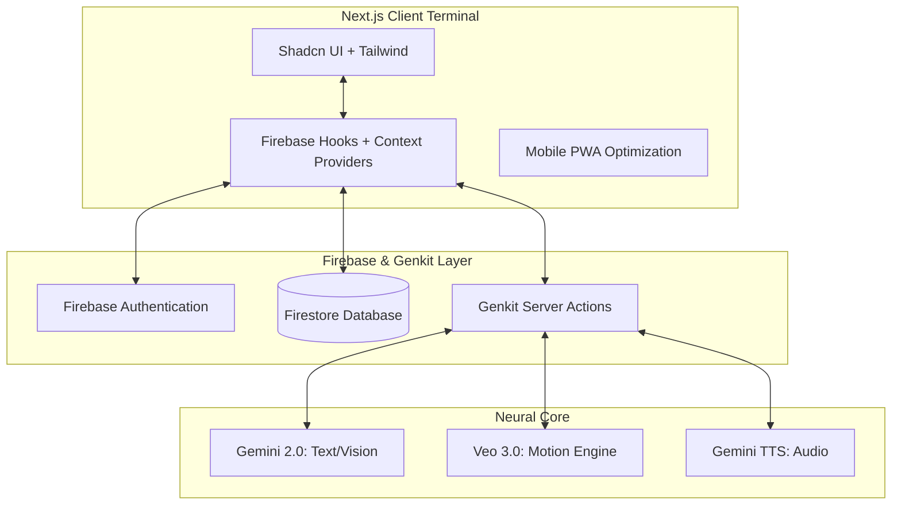

# AIva Assistant: Neural Glass OS

AIva is a high-performance, multimodal AI companion designed as a "Command Center" for the modern digital life. Built with a "Neural Glass" aesthetic, it leverages Gemini 2.0 and Veo 3.0 to provide a seamless, creative, and highly organized user experience.

## 🚀 Project Summary

AIva transcends traditional chatbots by integrating creative media generation, task management, and real-time communication simulation into a single, adaptive interface. Whether you're in "Deep Dark" (Black/Orange) or "Neural Light" (White/Orange) mode, AIva serves as an intelligent terminal for your neural cloud.

### Key Features
- **Multimodal Intelligence**: Live video and voice chat with real-time scene description and TTS.
- **Motion Engine (Veo 3 PRO)**: Cinematic 4K video generation with integrated spatial audio.
- **Neural Studio**: Atmospheric music and soundscape composition.
- **Intelligence Terminal**: A full-scale dashboard for tasks, schedule, and "Comm Intercepts."
- **Scenario Simulation**: Real-time intercept simulations for encrypted calls, messages, and voicemails.
- **Neural Tiers**: Subscription gating for high-consumption AI modules (Basic vs. Ultra).
- **Adaptive System**: Persistent user settings for themes (White/Orange vs. Black/Orange) and primary color accents.

## 🗺️ User Flow Journey

1. **Terminal Access**: Users enter via a high-fidelity Login/Signup portal.
2. **Neural Greeting**: The main chat interface initializes, offering "Starter Prompts" tailored to the user's subscription tier.
3. **Multimodal Interaction**: Users can type, speak, or upload images/files for analysis.
4. **Action & Creation**: Users trigger creative flows (Veo/Music) or manage their "Intelligence Action Items" (Tasks).
5. **Command Center**: The user navigates to the Dashboard for a top-down view of their synthesized day.
6. **Interface Config**: Users fine-tune their experience in Settings, adjusting the "Personality Matrix" or "System Theme."

## 🏗️ System Architecture

## 🛠️ Technologies Used

- **Framework**: Next.js 15 (App Router), React 18
- **Styling**: Tailwind CSS, Lucide Icons, Recharts (Activity Visualization)
- **UI Components**: Shadcn UI (Radix Primitives)
- **AI / GenAI**: Google Genkit, Gemini 2.0 Flash, Veo 3.0 (Video), Gemini TTS
- **Backend**: Firebase (Authentication, Firestore Real-time Database)
- **Deployment**: Firebase App Hosting (PWA Optimized)
- **Data Sources**: Unsplash API (Image Search), Google Translate (Interface Terminal)

## 💡 Findings & Learnings

1. **Optimistic UI**: Using Firestore's `onSnapshot` combined with non-blocking updates provides an "instant" feel that is critical for a high-performance assistant.
2. **Creative Latency**: Media generation (Veo 3) can take 30-60 seconds. Implementing "Task Labels" and pulsing status indicators is essential for maintaining user engagement during heavy synthesis.
3. **Adaptive Theming**: Moving from hardcoded colors to semantic CSS variables (`bg-background`, `text-primary`) allowed for a 100% reactive theme engine that updates every terminal instantly across devices.
4. **Multimodal Coherence**: Ensuring AIva's voice (TTS) matches her persona across different modules (Chat vs. Video Chat) creates a stronger sense of a singular "Neural Presence."

---
*Developed as a high-fidelity prototype for the future of AI Operating Systems.*