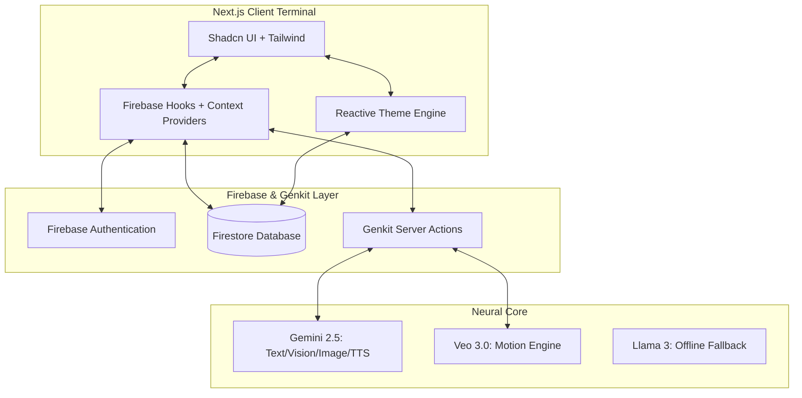

# AIva Assistant: Neural Glass OS

AIva is a high-performance, multimodal AI companion designed as a "Command Center" for the modern digital life. Built with a "Neural Glass" aesthetic, it leverages **Gemini 2.5 Flash** and **Veo 3.0** to provide a seamless, creative, and highly organized user experience.

## 🚀 Hackathon Pitch: The Future of Neural Interaction

AIva transcends traditional chatbots by integrating creative media generation, deep research synthesis, and real-time communication simulation into a single, adaptive interface. It is designed as a "Neural OS" that bridge the gap between abstract AI intelligence and practical daily utility.

### 🏆 Hackathon Judging Alignment
- **Technical Complexity**: Multi-model integration (Gemini 2.5 + Veo 3 + Llama 3 fallback), Real-time Firestore synchronization, and Contextual Security Rules.
- **Multimodal Innovation**: Simultaneous handling of Video Chat (Vision), Image Synthesis, and Neural Audio Mastering.
- **UI/UX Excellence**: "Neural Glass" design system using HSL-based reactive variables for 100% theme fluidity.
- **Real-World Utility**: Integrated Task Management, Scenario-based Communication Intercepts, and Subscription Gating.

### Key Features
- **Multimodal Intelligence (Gemini 2.5)**: High-performance chat with real-time vision, image analysis, and low-latency TTS (Text-to-Speech).
- **Motion Engine (Veo 3.0 PRO)**: Cinematic video generation with integrated spatial audio tracks.
- **Neural Studio**: Atmospheric music and soundscape composition using Gemini's high-fidelity audio synthesis.
- **Intelligence Terminal**: A full-scale dashboard for tasks, schedule, and real-time activity visualization.
- **Scenario Simulation**: Real-time "Comm Intercepts" for simulated encrypted calls, messages, and voicemails.
- **Neural Tiers**: Subscription gating for high-consumption AI modules (Basic vs. Ultra).
- **Adaptive System**: Persistent user settings for reactive themes (Light/Dark) and primary color accents.

## 🗺️ User Flow Journey

1. **Neural Onboarding**: A cinematic entry sequence introduces the user to the AIva Neural Core.
2. **Terminal Access**: Users enter via a high-fidelity Login/Signup portal secured by Firebase Auth.
3. **Multimodal Interaction**: Users type, speak, or upload images for analysis. AIva responds with text, speech, or specialized UI "Intel Cards."
4. **Action & Creation**: Users trigger creative flows (Veo Video/Neural Music) or perform "Deep Research" synthesis.
5. **Command Center**: The user navigates to the Dashboard for a top-down view of their synthesized day (Tasks, Weather, Schedule).
6. **Interface Config**: Users fine-tune their experience in Settings, adjusting the "Personality Matrix" or upgrading to the "Neural Ultra" tier.

## 🏗️ System Architecture

## 🛠️ Technologies Used

- **Framework**: Next.js 15 (App Router), React 18
- **Styling**: Tailwind CSS, Lucide Icons, Recharts (Activity Visualization)
- **UI Components**: Shadcn UI (Radix Primitives)
- **AI / GenAI**: Google Genkit, Gemini 2.5 Flash (Text/Vision/Image/TTS), Veo 3.0 (Video)
- **Backend**: Firebase (Authentication, Firestore Real-time Database)
- **External Data**: Unsplash API (Visual Search), Google Translate (Localization)

## 💡 Findings & Learnings

1. **Optimistic UI with Firestore**: Using `onSnapshot` combined with non-blocking updates provides an "instant" feel critical for a high-performance assistant.
2. **Managing Multimodal Latency**: Implementing "Task Labels" and pulsing status indicators is essential for maintaining user engagement during heavy media synthesis cycles (Veo 3).
3. **Adaptive Semantic Theming**: Moving from hardcoded colors to HSL CSS variables allowed for a 100% reactive theme engine that updates every terminal instantly.
4. **Offline Resilience**: Integrating a local LLM fallback (Ollama) ensures that the assistant remains "intelligent" even in the absence of a neural cloud connection.

---
*Developed as a high-fidelity prototype for the future of AI Operating Systems.*
